

The [Astroknot puzzle](http://puzzlesolver.com/puzzle.php?id=45) is one of the most difficult wire-and-string tanglement puzzles I’ve found. This page explains how to solve it, and in the process some general ideas about solving tanglement/topology-ladder puzzles. Here’s a picture of the puzzle; the goal is to remove the string.

Before going into specifics, there's an important general strategy for circumventing "stuff" that prevents you from passing over a wire loop. The steps are, 
 1. pass the string through the loop, 
 2. circumvent the stuff in the way, and then 
 3. pass the string back through the loop. 
This is shown in the following image:

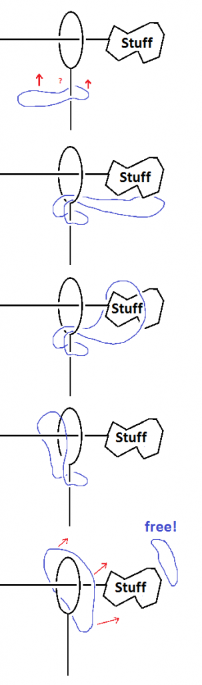

Now let's go back to the Astroknot. One of the first things we notice is that it's complicated and hard to understand as a whole. In order to attack the problem, let's simplify it a little by doing an imaginary deformation of the outer wire loops so that we can better understand the structure. These loops are made out of metal so we can't bend them in real life, but that doesn't prevent us from bending them in our head.

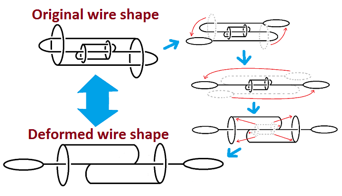

Now we can devise a strategy based on this deformed shape, and then when we implement it on the real shape, we will just do an extra circumvention sequence (compound move) whenever we want to move a loop of string over the outer wire loops. This is shown in the following image:

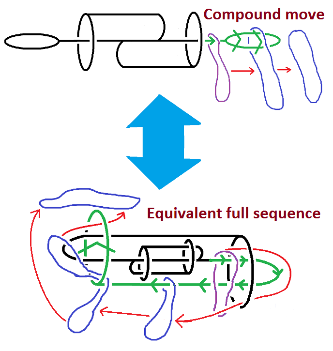

Now let's develop our strategy on the deformed version. There's really just one wire that we trace around from the start to the finish, avoiding other obstructions along the way.

In the actual puzzle, this looks like the following.

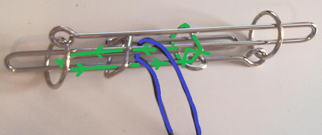

To go from step 1 to step 2, we just go out and around the left wire loop (which implicitly involves going around the whole thing during the compound move):

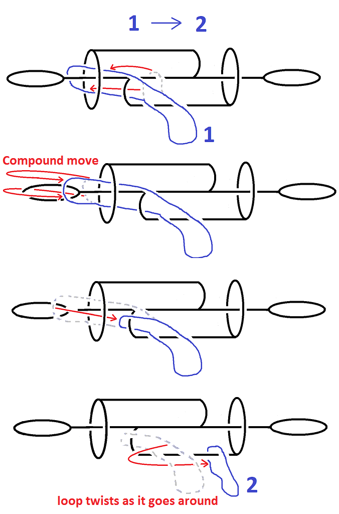

Let's look at that sequence in a little more detail.

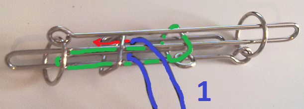

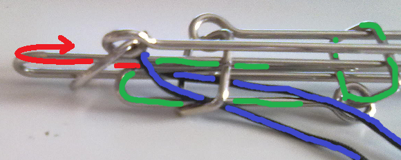

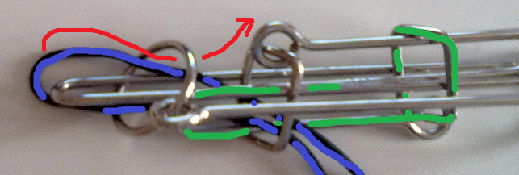

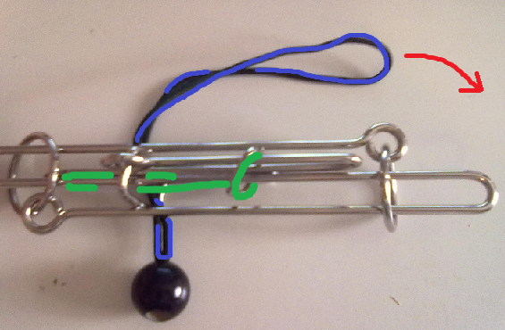

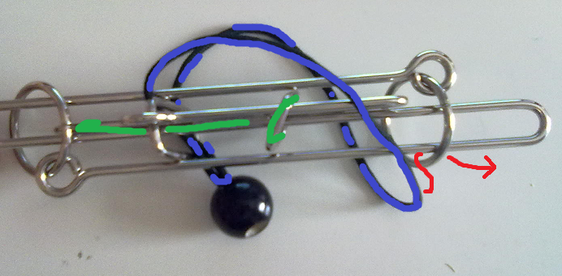

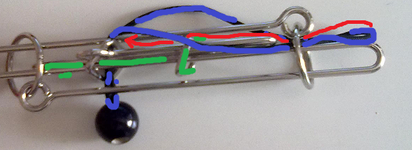

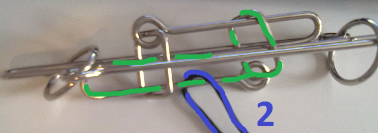

Then to go from step 2 to step 3, we do essentially the same thing, but just through the other inner wire loop.

In detail, we have the following,

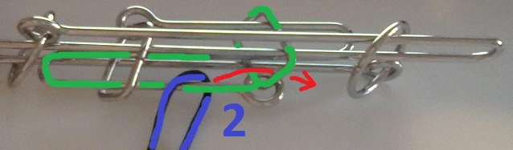

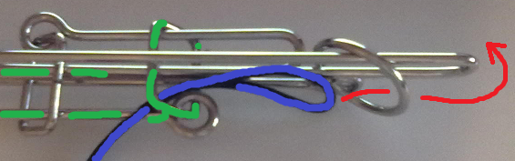

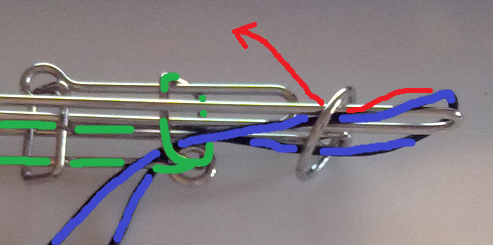

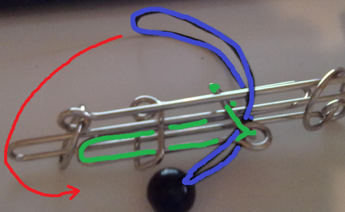

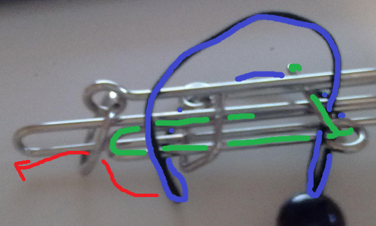

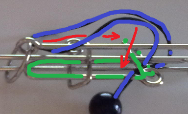

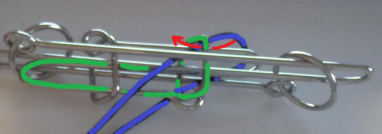

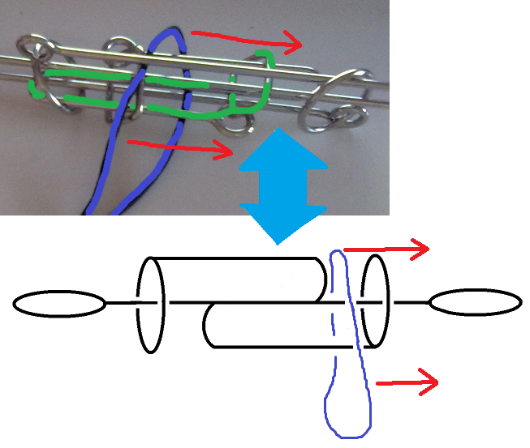

Now we have escaped the inner loops for good, and only have to do one more compound move to take the string off the outer loop.

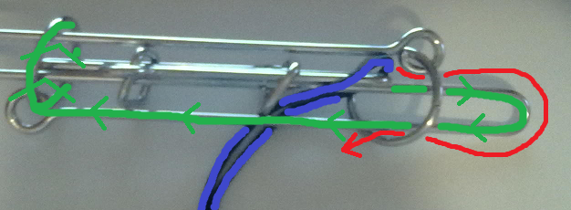

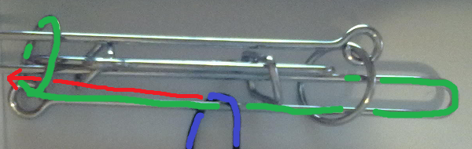

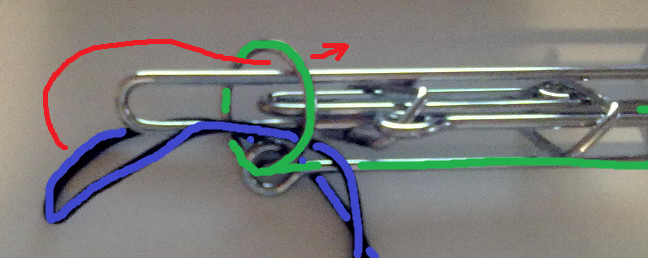

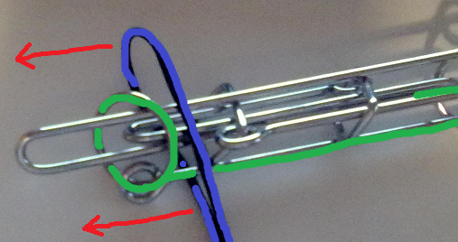

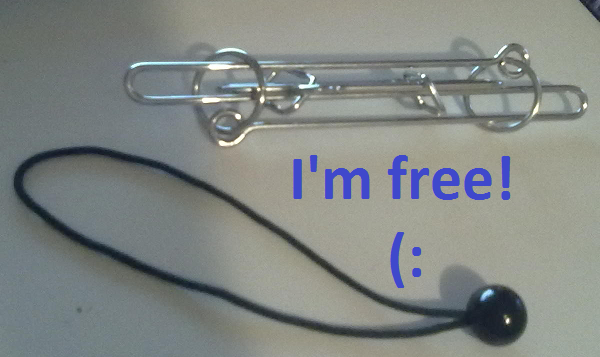

----

# See also:

 - [Kevin Sadler's review](http://www.puzzlemad.co.uk/2012/02/last-batch-of-livewire-puzzles-9.html) of the Astroknot puzzle on [PuzzleMad](http://www.puzzlemad.co.uk/)
