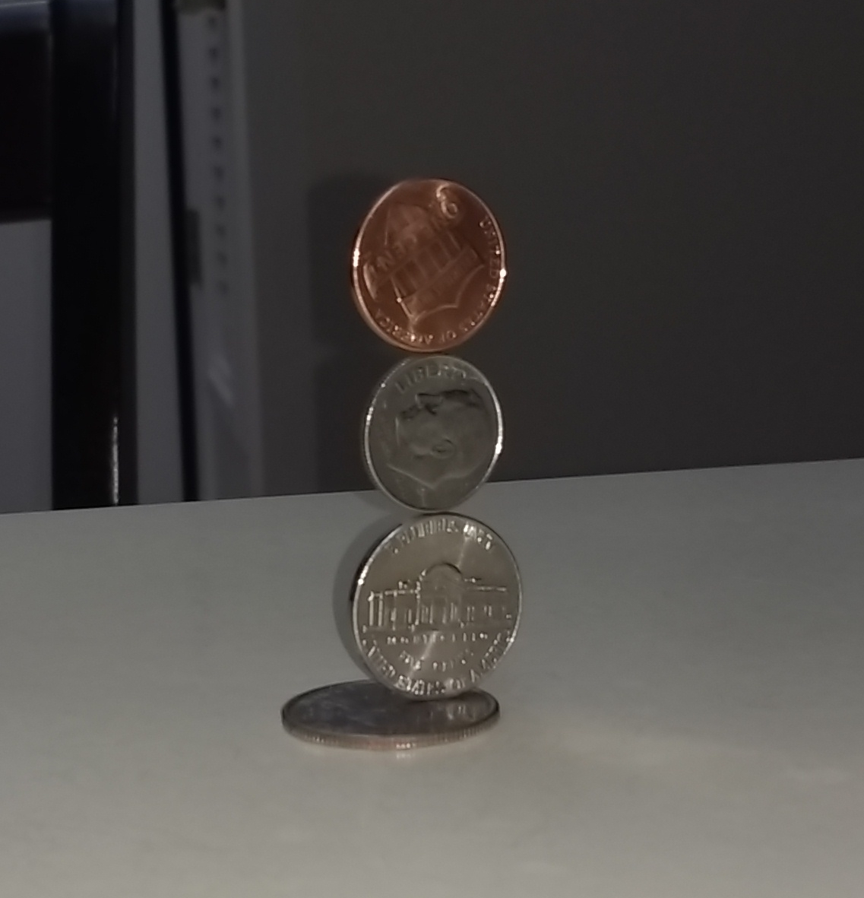
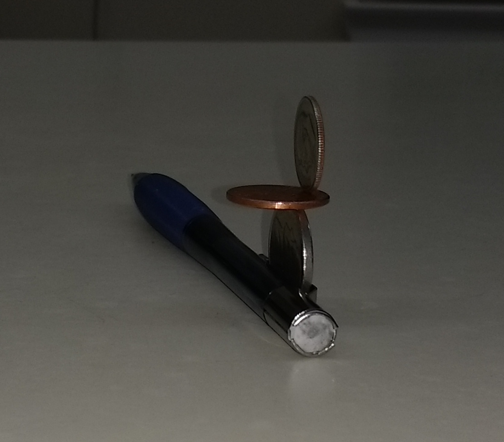
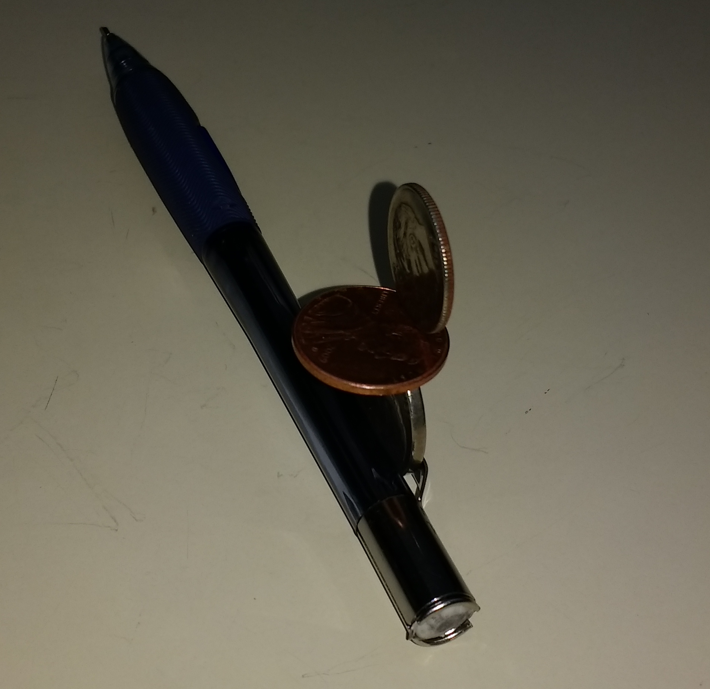
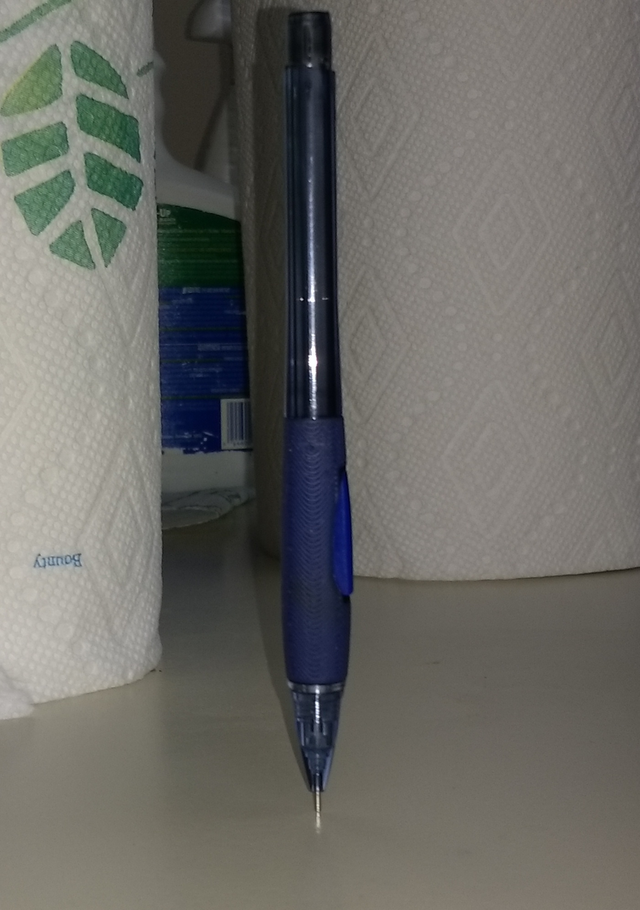
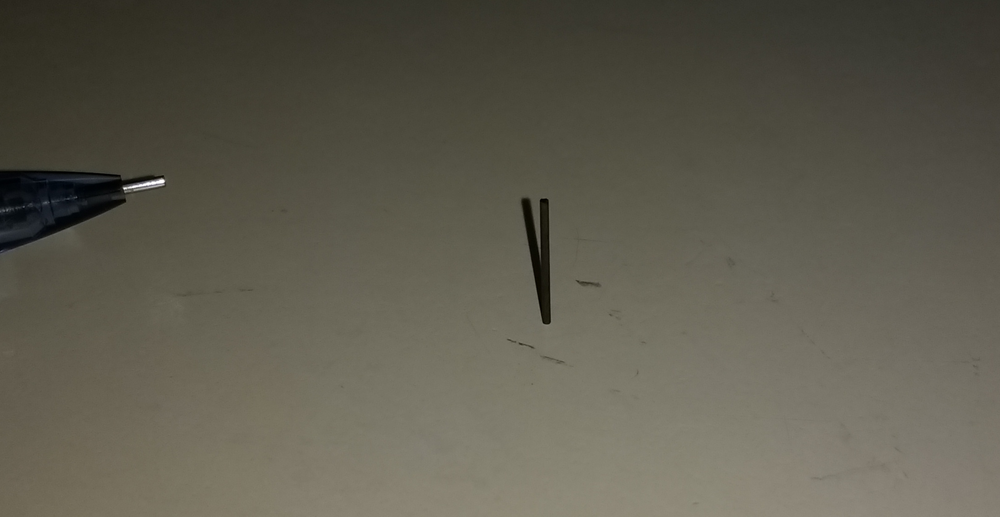
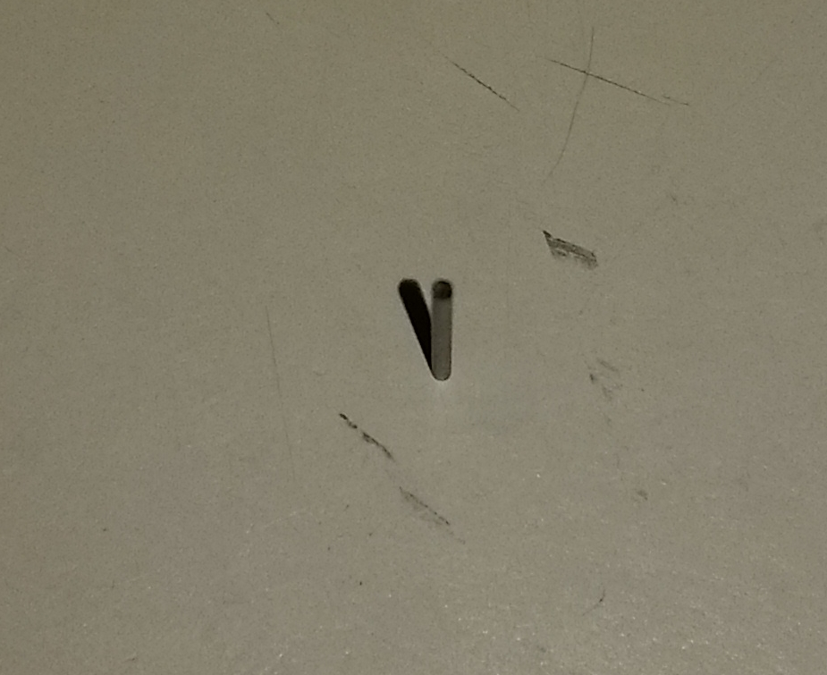
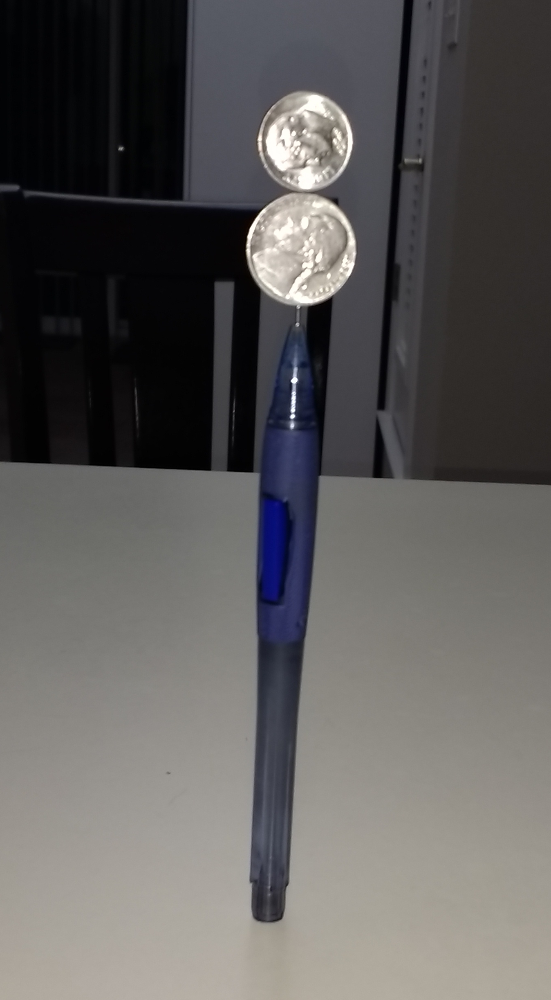
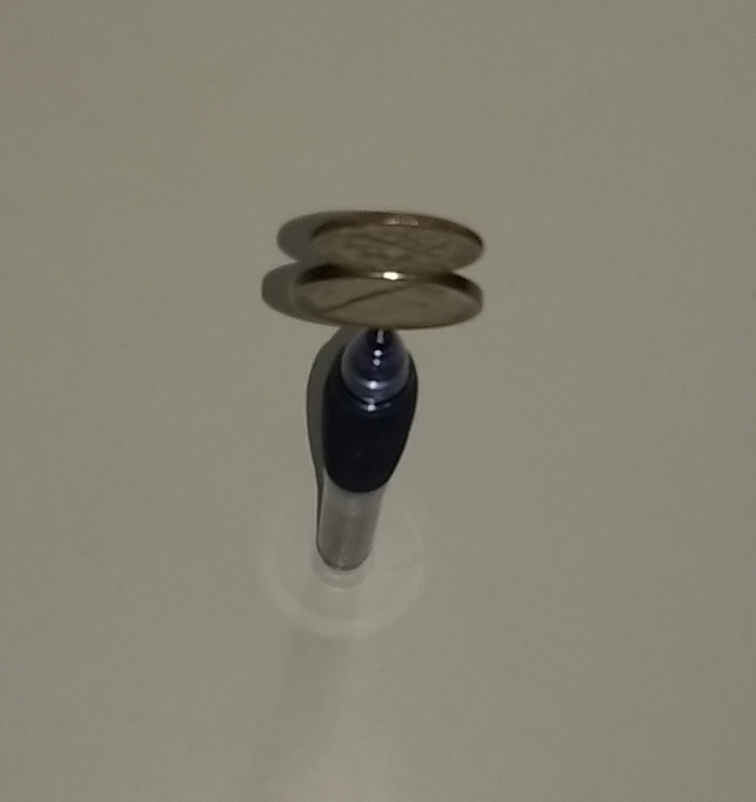

# Triple coin balance

**Video:** [https://www.youtube.com/watch?v=uKhCzyvYJ6I](https://www.youtube.com/watch?v=uKhCzyvYJ6I)

# Cantilever coin balance

# Pencil balanced on its tip

# Pencil lead

# Double coin on pencil tip

