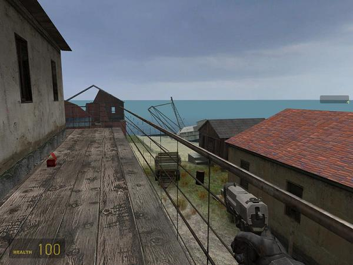
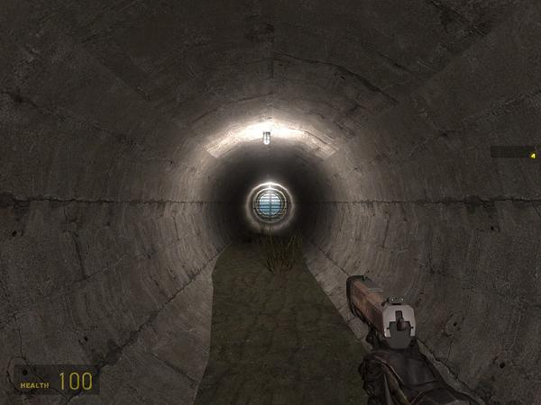
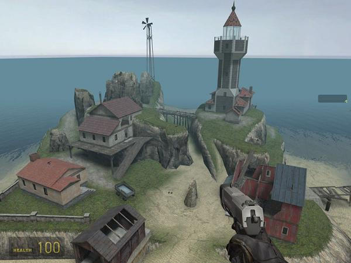

Dm_Island17 was made for the 2004/2005 Valve Half-Life 2: Deathmatch mapping contest that coincided with the launch of Half-Life 2. Contest rules required that the map use only stock content (textures, models, etc). The map is set on Island17, an island off the coast of City 17. Expect lots of vertical combat.

**Download:** [dm_island17.zip](./dm_island17/dm_island17.zip) (map file is dm_island17.bsp)

**Source:** [dm_island17_vmf.zip](./dm_island17/dm_island17_vmf.zip)

Anyone is welcome to remake/remix or otherwise use the source file in their own projects as they see fit.

# Remakes/remixes/other

