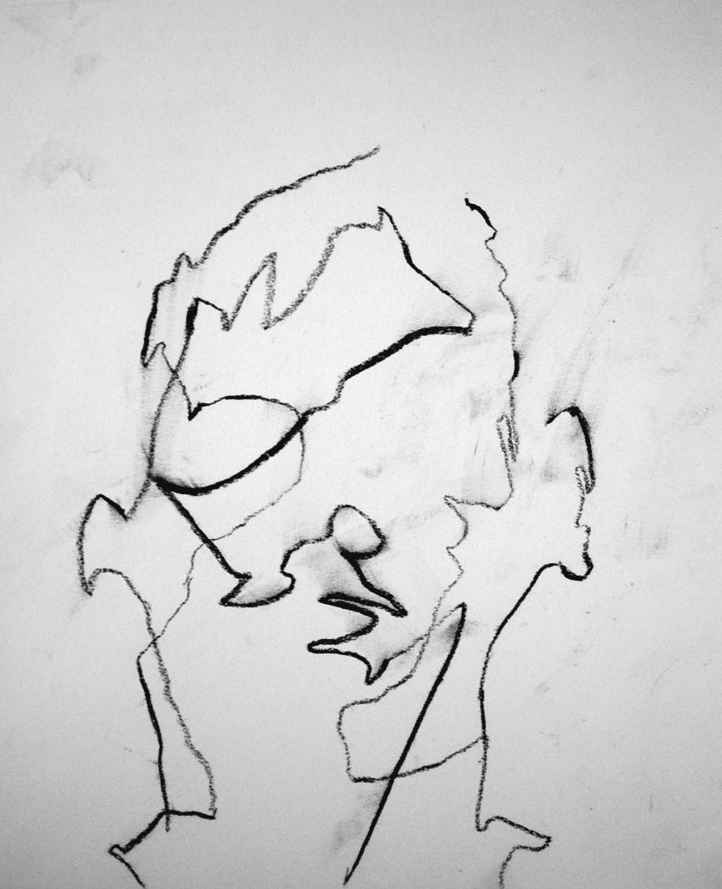
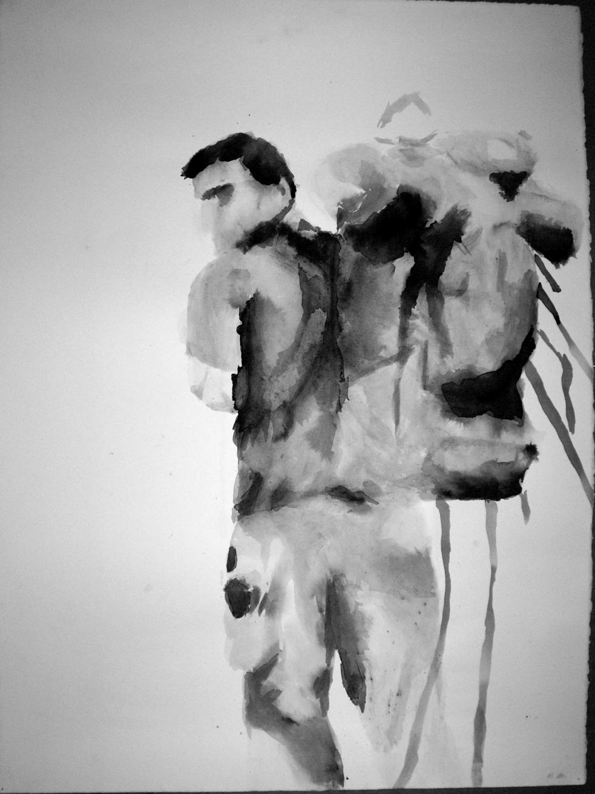
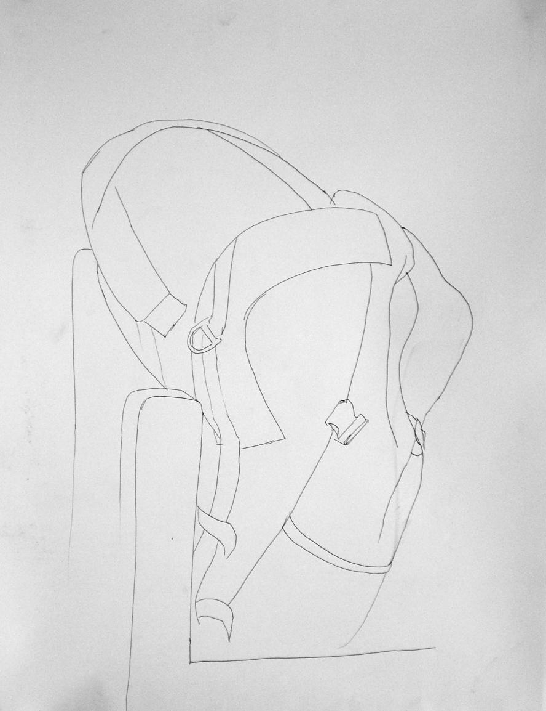
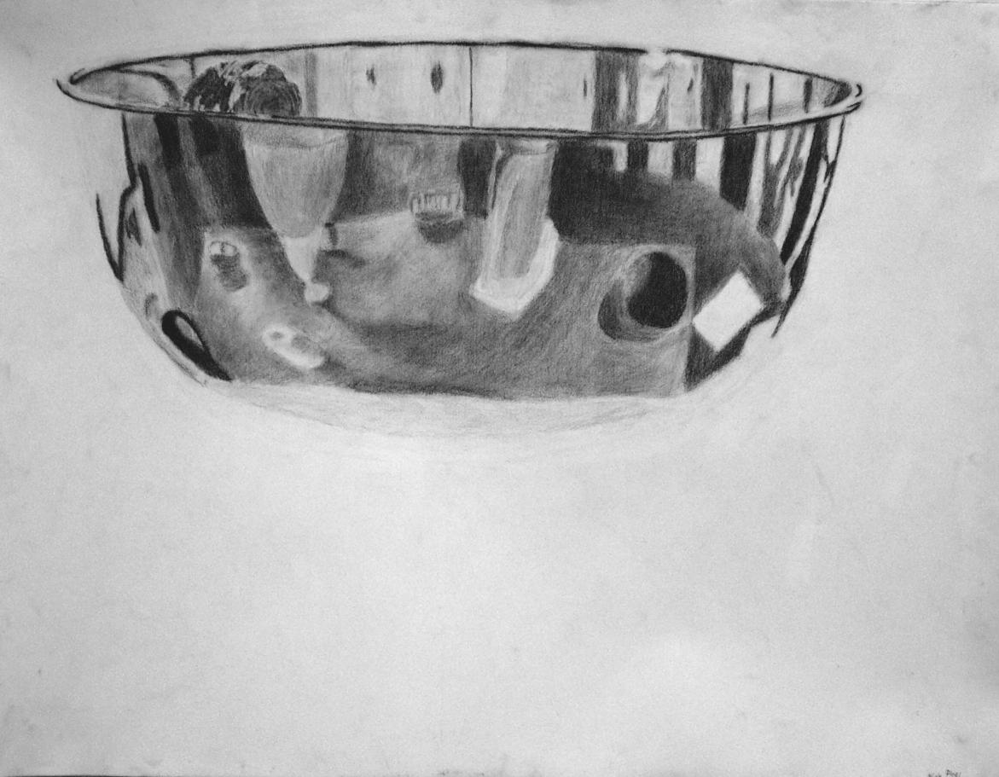
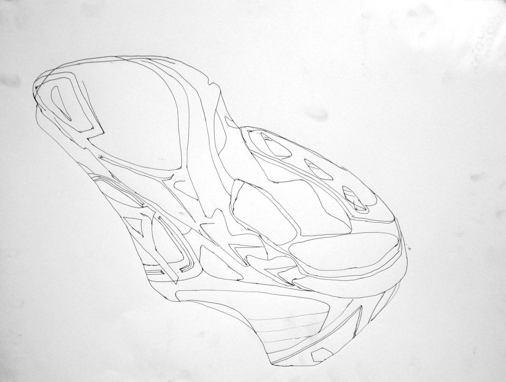
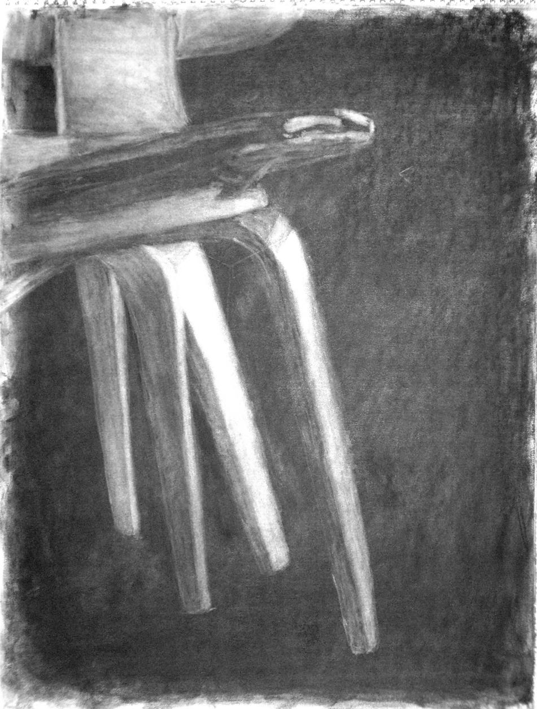
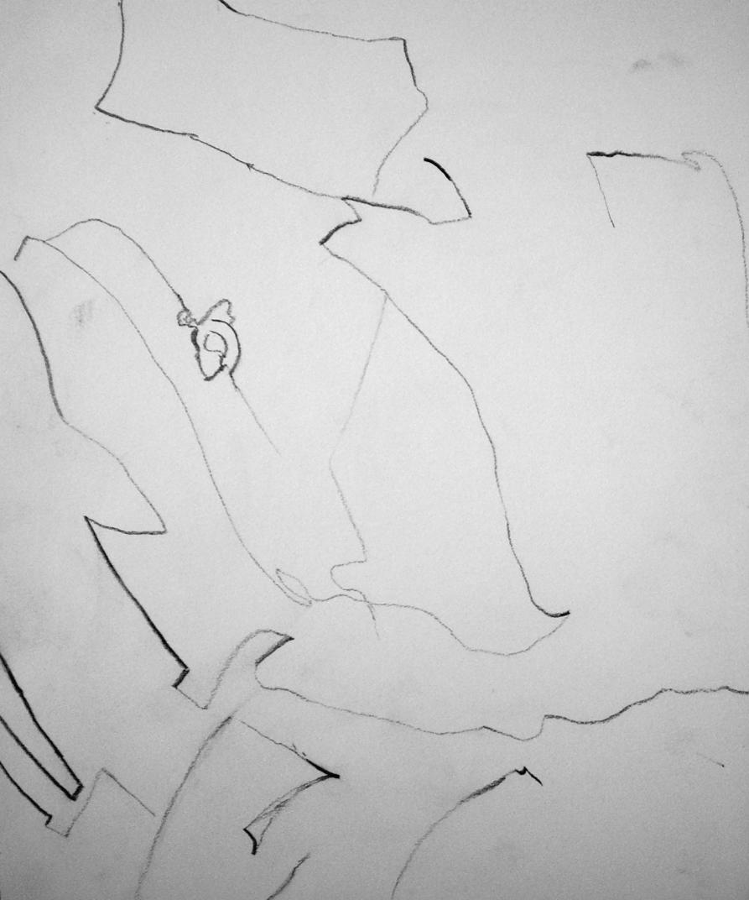
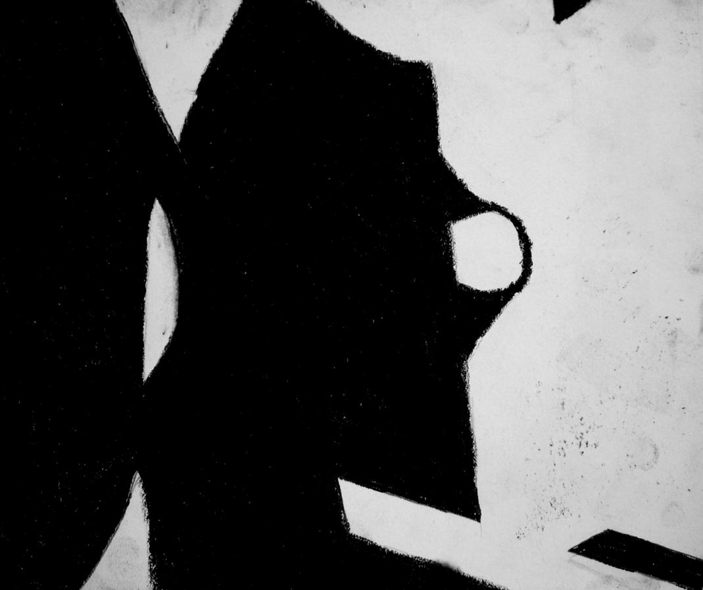

# Unicycle

Hub, cranks, and fork of a unicycle.

# Face

Blind contour drawing of a face.

# Leaving

Self portrait drawn by painting water onto the canvas, then dropping ink onto it.

# Backpack

Contour drawing of a backpack on a chair.

# Bowl

Fun with reflections and a hackey sack.

# Shoe

Line drawing of the bottom of my shoe, drawn in pen.

# Chairs

Two chairs drawn by erasing. Similar to mapping in UnrealED.

# Shirt

Trying to show the folds of my shirt with lines.

# Shape

An abstract positive/negative shape

