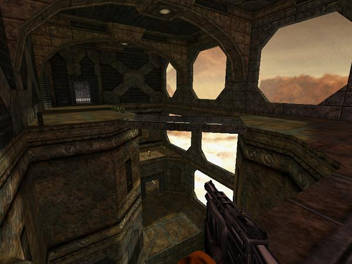

Catacomb is a Half-Life: Deathmatch map set in a facility on mars. The layout is complicated and interconnected, and there are many secret areas. This is my favorite map I’ve made. Props to Sock for the awesome textures.

**Download:** [catacomb.zip](catacomb.zip) (catacomb.bsp + custom sounds, sprites, etc)

**Source (late beta?):** [catacomb_beta697.rmf](catacomb_beta697.rmf)

