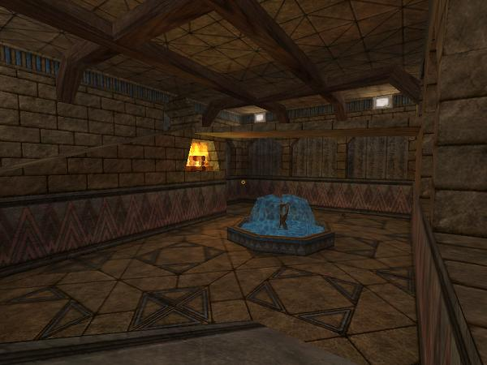

Megalith2 is a Half-Life: Deathmatch map set in an ancient egyptian temple. Structurally this map is an outdoor arena sitting above an underground complex, inspired by the gameplay dynamics of Valve’s level Gasworks. This was my first “serious” map. The rolling boulder in this map is the reason why I first started making spheres. Also of note is the teleportation system that uses a Random Event Generator to choose random destinations. Megalith2 uses Sock’s egyptian textures, which rock.

This map is the second version of Megalith. In this version the raised stone ring in the outdoor area is removed, the lighting is tweaked, some sound effects are added, and a few minor bugs are fixed. This version won Planet Half-Life Level of the Week (PHL LotW). I’ve been told that the map was included on a CD with an issue of PC Gameplay UK magazine several years ago. If anyone could confirm or deny this I would be grateful.

**Download:** [megalith2.zip](megalith2.zip) (megalith2.bsp + custom sprites, etc)

**Source files:** [megalith2_rmf.zip](megalith2_rmf.zip)

