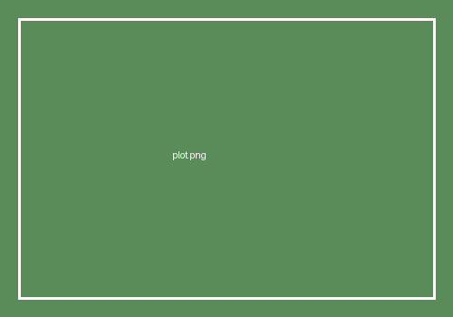

[Intro paragraph — what problem this note addresses, and why it came up in the course of your research.]

## [Section heading]

[Prose explaining the idea, with math where useful, e.g. $\|Ax - b\|_2$.]

```python
# Illustrative code snippet — syntax-highlighted, not executed.
import numpy as np

def residual(A, x, b):
    return np.linalg.norm(A @ x - b)
```

{fig-align="center" width="60%"}

[Wrap-up / takeaway paragraph.]
